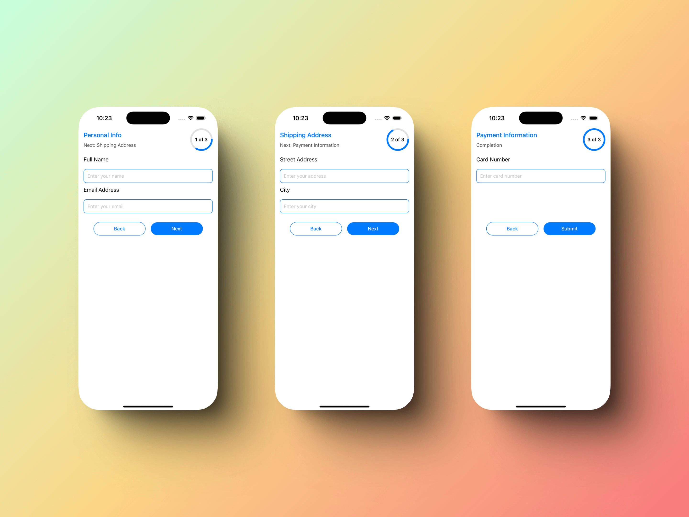
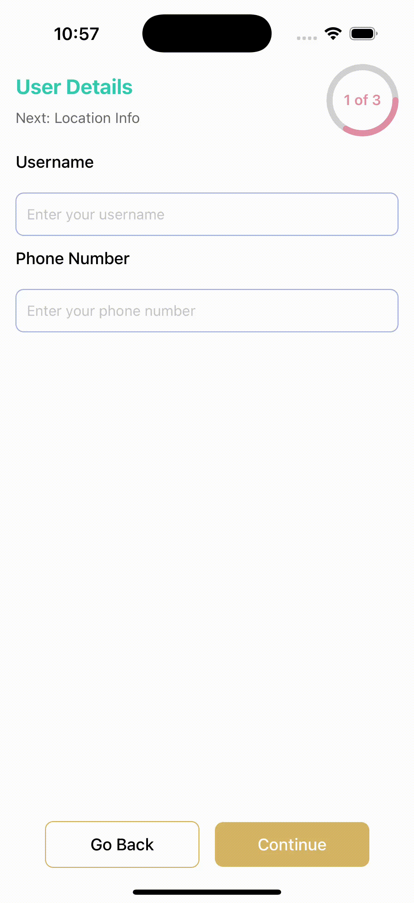
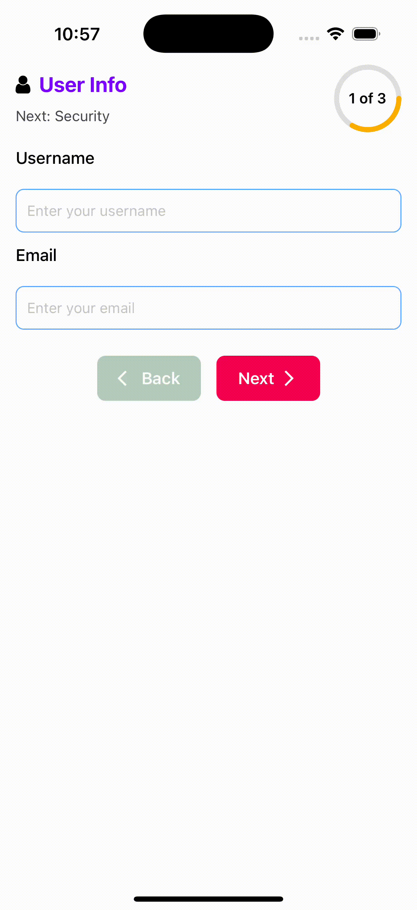
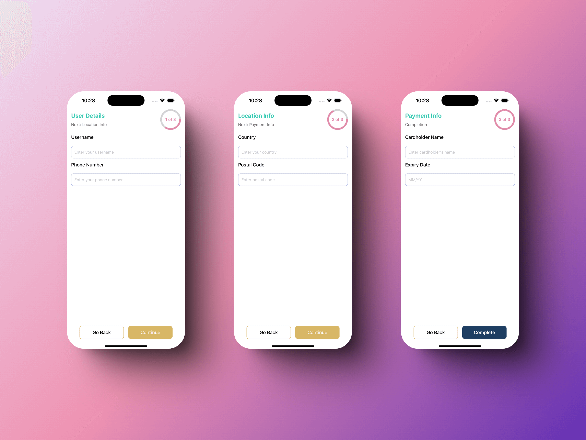
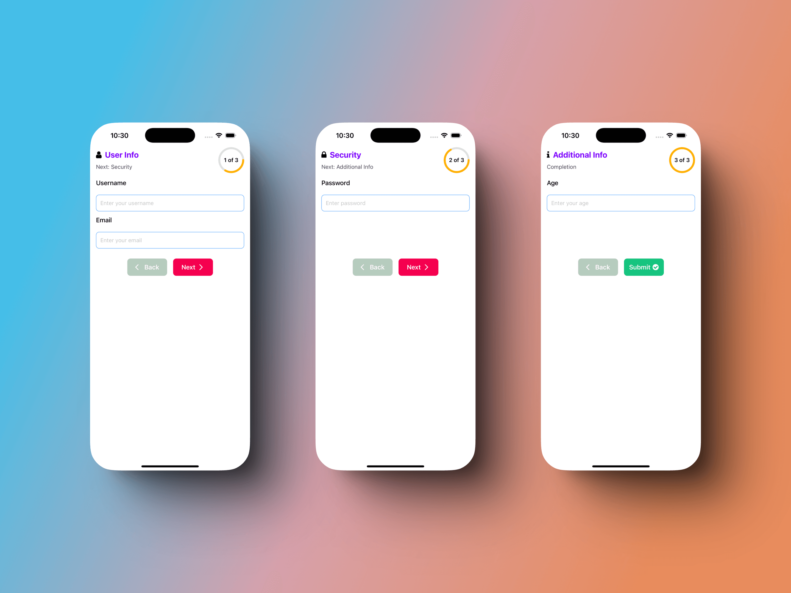

# react-native-multistep

A lightweight multi-step view component for React Native with smooth transitions using Reanimated



<p align="center">
  
  
  
</p>

## Installation

```sh
npm install react-native-multistep
```

### Peer Dependencies

This package relies on the following peer dependencies. Make sure they are installed in your project:

1. **`react-native-reanimated`**
   This library is used for smooth animations and transitions.
   Install it using:
   ```bash
   npm install react-native-reanimated
   ```
   Follow the [official installation guide](https://docs.swmansion.com/react-native-reanimated/docs/fundamentals/installation) to set it up correctly.

2. **`react-native-svg`**
   This library is used for rendering SVG graphics.
   Install it using:
   ```bash
   npm install react-native-svg@>=15.0.0
   ```
   Follow the [official installation guide](https://github.com/software-mansion/react-native-svg#installation) to configure it properly.


### Notes:
- Ensure that these libraries are installed and linked correctly in your React Native project.
- If you encounter any issues, refer to the official documentation for each library.

## Usage


```js
import { Text, View } from 'react-native';
import { MultiStep, Step } from 'react-native-multistep';

const App = () => {
  return (
    <MultiStep onFinalStepSubmit={() => alert('Submitted!')}>
      <Step title="Step 1">
        <Text>Welcome to Step 1</Text>
      </Step>
      <Step title="Step 2">
        <Text>Fill in some details here.</Text>
      </Step>
      <Step title="Step 3">
        <Text>Review your information.</Text>
      </Step>
    </MultiStep>
  );
};

export default App;
```

## Customizing and Styling

You can customize the styling of the `MultiStep` and `Step` components to match your app's aesthetics. The provided table lists all the available properties that you can use to adjust the appearance and behavior of the multi-step process. This includes customizing button styles, text styles, progress indicators, and container styles.



### Example: Custom Styling

Here's an example of how to apply custom styling to the `MultiStep` and `Step` components:

```js
import { useState } from 'react';
import { Text, TextInput, StyleSheet } from 'react-native';
import { MultiStep, Step } from 'react-native-multistep';

const StyledMultiStep = () => {
  const [formData, setFormData] = useState({
    username: '',
    phone: '',
    country: '',
    postalCode: '',
    cardHolder: '',
    expiryDate: '',
  });

  const handleChange = (field: string, value: string) => {
    setFormData((prev) => ({ ...prev, [field]: value }));
  };

  const handleSubmit = () => {
    console.log('Submitted Data:', formData);
  };

  return (
    <MultiStep
      onFinalStepSubmit={handleSubmit}
      nextButtonText="Continue"
      prevButtonText="Go Back"
      submitButtonText="Complete"
      nextButtonStyle={styles.nextButton}
      prevButtonStyle={styles.prevButton}
      submitButtonStyle={styles.submitButton}
      nextButtonTextStyle={styles.nextButtonText}
      prevButtonTextStyle={styles.prevButtonText}
      submitButtonTextStyle={styles.submitButtonText}
      progressCircleSize={70}
      progressCircleThickness={6}
      progressCircleColor="#e290a6"
      progressCircleTrackColor="#D3D3D3"
      progressCircleLabelStyle={styles.progressText}
      globalStepTitleStyle={styles.stepTitle}
      globalNextStepTitleStyle={styles.nextStepTitle}
      fullScreenHeight
    >
      <Step title="User Details" stepContainerStyle={styles.stepContent}>
        <Text style={styles.label}>Username</Text>
        <TextInput
          style={styles.input}
          placeholder="Enter your username"
          value={formData.username}
          onChangeText={(text) => handleChange('username', text)}
        />
        <Text style={styles.label}>Phone Number</Text>
        <TextInput
          style={styles.input}
          placeholder="Enter your phone number"
          value={formData.phone}
          keyboardType="phone-pad"
          onChangeText={(text) => handleChange('phone', text)}
        />
      </Step>

      <Step title="Location Info" stepContainerStyle={styles.stepContent}>
        <Text style={styles.label}>Country</Text>
        <TextInput
          style={styles.input}
          placeholder="Enter your country"
          value={formData.country}
          onChangeText={(text) => handleChange('country', text)}
        />
        <Text style={styles.label}>Postal Code</Text>
        <TextInput
          style={styles.input}
          placeholder="Enter postal code"
          value={formData.postalCode}
          keyboardType="numeric"
          onChangeText={(text) => handleChange('postalCode', text)}
        />
      </Step>

      <Step title="Payment Info" stepContainerStyle={styles.stepContent}>
        <Text style={styles.label}>Cardholder Name</Text>
        <TextInput
          style={styles.input}
          placeholder="Enter cardholder's name"
          value={formData.cardHolder}
          onChangeText={(text) => handleChange('cardHolder', text)}
        />
        <Text style={styles.label}>Expiry Date</Text>
        <TextInput
          style={styles.input}
          placeholder="MM/YY"
          value={formData.expiryDate}
          keyboardType="numeric"
          onChangeText={(text) => handleChange('expiryDate', text)}
        />
      </Step>
    </MultiStep>
  );
};

export default StyledMultiStep;

const styles = StyleSheet.create({
  stepContent: {
    gap: 12,
  },
  label: {
    fontSize: 16,
    marginBottom: 8,
    fontWeight: '500',
  },
  input: {
    height: 42,
    borderWidth: 1,
    borderColor: '#A6B1E1',
    borderRadius: 8,
    paddingHorizontal: 10,
    backgroundColor: '#FFF',
  },
  stepTitle: {
    fontSize: 20,
    fontWeight: 'bold',
    color: '#36cab2',
  },
  nextStepTitle: {
    color: '#696969',
  },
  progressText: {
    fontSize: 14,
    fontWeight: '600',
    color: '#e290a6',
  },
  nextButton: {
    backgroundColor: '#d7b665',
    paddingVertical: 12,
    borderRadius: 8,
  },
  nextButtonText: {
    color: '#FFF',
    fontSize: 16,
  },
  prevButton: {
    paddingVertical: 12,
    borderRadius: 8,
    borderColor: '#d7b665',
  },
  prevButtonText: {
    color: '#000',
    fontSize: 16,
  },
  submitButton: {
    backgroundColor: '#1E3E62',
    paddingVertical: 12,
    borderRadius: 8,
  },
  submitButtonText: {
    color: '#FFF',
    fontSize: 16,
  },
});

```

## Custom Components

You can also provide custom components for titles, buttons, and much more. This allows for greater flexibility and customization to match your app's design and functionality.



### Example: Custom Components

Here's an example of how to use custom components for the step titles and buttons:

```js
import { useState, useRef } from 'react';
import {
  Text,
  TextInput,
  StyleSheet,
  View,
  TouchableOpacity,
} from 'react-native';
import { MultiStep, Step, type MultiStepRef } from 'react-native-multistep';
import { FontAwesome, MaterialIcons } from '@expo/vector-icons';

const CustomDesign = () => {
  const [formData, setFormData] = useState({
    username: '',
    email: '',
    password: '',
    age: '',
  });

  const handleChange = (field: string, value: string) => {
    setFormData((prev) => ({ ...prev, [field]: value }));
  };

  const handleSubmit = () => {
    console.log('Final Form Data:', formData);
  };

  const ref = useRef<MultiStepRef>(null);

  return (
    <MultiStep
      onFinalStepSubmit={handleSubmit}
      tintColor="#AD49E1"
      progressCircleColor="#FFAF00"
      nextButtonComponent={
        <NextButton onPress={() => ref.current?.nextStep()} />
      }
      prevButtonComponent={
        <PrevButton onPress={() => ref.current?.prevStep()} />
      }
      submitButtonComponent={<SubmitButton onPress={handleSubmit} />}
      ref={ref}
    >
      <Step
        title="User Info"
        titleComponent={<StepTitle title="User Info" icon="user" />}
        stepContainerStyle={styles.stepContent}
      >
        <Text style={styles.label}>Username</Text>
        <TextInput
          style={styles.input}
          placeholder="Enter your username"
          value={formData.username}
          onChangeText={(text) => handleChange('username', text)}
        />
        <Text style={styles.label}>Email</Text>
        <TextInput
          style={styles.input}
          placeholder="Enter your email"
          value={formData.email}
          keyboardType="email-address"
          onChangeText={(text) => handleChange('email', text)}
        />
      </Step>

      <Step
        title="Security"
        titleComponent={<StepTitle title="Security" icon="lock" />}
        stepContainerStyle={styles.stepContent}
      >
        <Text style={styles.label}>Password</Text>
        <TextInput
          style={styles.input}
          placeholder="Enter password"
          secureTextEntry
          value={formData.password}
          onChangeText={(text) => handleChange('password', text)}
        />
      </Step>

      <Step
        title="Additional Info"
        titleComponent={<StepTitle title="Additional Info" icon="info" />}
        stepContainerStyle={styles.stepContent}
      >
        <Text style={styles.label}>Age</Text>
        <TextInput
          style={styles.input}
          placeholder="Enter your age"
          keyboardType="numeric"
          value={formData.age}
          onChangeText={(text) => handleChange('age', text)}
        />
      </Step>
    </MultiStep>
  );
};

export default CustomDesign;

const StepTitle = ({
  title,
  icon,
}: {
  title: string;
  icon: 'user' | 'lock' | 'info';
}) => (
  <View style={styles.stepTitleContainer}>
    <FontAwesome name={icon} size={20} color="#000" />
    <Text style={styles.stepTitle}>{title}</Text>
  </View>
);

const NextButton = ({ onPress }: { onPress: () => void }) => (
  <TouchableOpacity style={styles.nextButton} onPress={onPress}>
    <Text style={styles.buttonText}>Next</Text>
    <MaterialIcons name="arrow-forward-ios" size={18} color="white" />
  </TouchableOpacity>
);

const PrevButton = ({ onPress }: { onPress: () => void }) => (
  <TouchableOpacity style={styles.prevButton} onPress={onPress}>
    <MaterialIcons name="arrow-back-ios" size={18} color="white" />
    <Text style={styles.buttonText}>Back</Text>
  </TouchableOpacity>
);

const SubmitButton = ({ onPress }: { onPress: () => void }) => (
  <TouchableOpacity style={styles.submitButton} onPress={onPress}>
    <Text style={styles.buttonText}>Submit</Text>
    <FontAwesome name="check-circle" size={18} color="white" />
  </TouchableOpacity>
);

const styles = StyleSheet.create({
  stepContent: {
    gap: 12,
  },
  label: {
    fontSize: 16,
    marginBottom: 8,
    fontWeight: '500',
  },
  input: {
    height: 42,
    borderWidth: 1,
    borderColor: '#5CA9FF',
    borderRadius: 8,
    paddingHorizontal: 10,
    backgroundColor: '#FFF',
  },
  stepTitleContainer: {
    flexDirection: 'row',
    alignItems: 'center',
    gap: 8,
  },
  stepTitle: {
    fontSize: 20,
    fontWeight: 'bold',
    color: '#7C00FE',
  },
  nextButton: {
    flexDirection: 'row',
    alignItems: 'center',
    justifyContent: 'center',
    gap: 5,
    backgroundColor: '#F5004F',
    paddingVertical: 12,
    borderRadius: 8,
    width: 100,
  },
  prevButton: {
    flexDirection: 'row',
    alignItems: 'center',
    justifyContent: 'center',
    gap: 5,
    backgroundColor: '#B6CBBD',
    paddingVertical: 12,
    borderRadius: 8,
    width: 100,
  },
  submitButton: {
    flexDirection: 'row',
    alignItems: 'center',
    justifyContent: 'center',
    gap: 5,
    backgroundColor: '#16C47F',
    paddingVertical: 12,
    borderRadius: 8,
    width: 100,
  },
  buttonText: {
    fontSize: 16,
    color: 'white',
    fontWeight: '600',
  },
});

```

## Using react-hook-form with react-native-multistep

You can integrate `react-hook-form` with `react-native-multistep` to manage form state and validation across multiple steps. Below is an example demonstrating how to use `react-hook-form` with `react-native-multistep`.

### Example: Integrating react-hook-form

```js
import { useForm, Controller } from 'react-hook-form';
import { Text, TextInput, StyleSheet } from 'react-native';
import { MultiStep, Step } from 'react-native-multistep';

const ReactHookForm = () => {
  const { control, handleSubmit } = useForm({
    defaultValues: {
      name: '',
      email: '',
      address: '',
      city: '',
      cardNumber: '',
    },
  });

  const onSubmit = (data: any) => {
    console.log('Final Form Data:', data);
  };

  return (
    <MultiStep
      onFinalStepSubmit={handleSubmit(onSubmit)}
      tintColor="#DA498D"
      fullScreenHeight
    >
      <Step title="Personal Info" stepContainerStyle={styles.stepContent}>
        <Text style={styles.label}>Full Name</Text>
        <Controller
          control={control}
          name="name"
          render={({ field: { onChange, value } }) => (
            <TextInput
              style={styles.input}
              placeholder="Enter your name"
              value={value}
              onChangeText={onChange}
            />
          )}
        />
        <Text style={styles.label}>Email Address</Text>
        <Controller
          control={control}
          name="email"
          render={({ field: { onChange, value } }) => (
            <TextInput
              style={styles.input}
              placeholder="Enter your email"
              value={value}
              keyboardType="email-address"
              onChangeText={onChange}
            />
          )}
        />
      </Step>

      <Step title="Shipping Address" stepContainerStyle={styles.stepContent}>
        <Text style={styles.label}>Street Address</Text>
        <Controller
          control={control}
          name="address"
          render={({ field: { onChange, value } }) => (
            <TextInput
              style={styles.input}
              placeholder="Enter your address"
              value={value}
              onChangeText={onChange}
            />
          )}
        />
        <Text style={styles.label}>City</Text>
        <Controller
          control={control}
          name="city"
          render={({ field: { onChange, value } }) => (
            <TextInput
              style={styles.input}
              placeholder="Enter your city"
              value={value}
              onChangeText={onChange}
            />
          )}
        />
      </Step>

      <Step title="Payment Information" stepContainerStyle={styles.stepContent}>
        <Text style={styles.label}>Card Number</Text>
        <Controller
          control={control}
          name="cardNumber"
          render={({ field: { onChange, value } }) => (
            <TextInput
              style={styles.input}
              placeholder="Enter card number"
              value={value}
              keyboardType="numeric"
              onChangeText={onChange}
            />
          )}
        />
      </Step>
    </MultiStep>
  );
};

export default ReactHookForm;

const styles = StyleSheet.create({
  stepContent: {
    gap: 10,
  },
  label: {
    fontSize: 16,
    marginBottom: 8,
  },
  input: {
    height: 40,
    borderWidth: 1,
    borderColor: '#DA498D',
    borderRadius: 8,
    paddingHorizontal: 10,
    backgroundColor: '#FFF',
  },
});

```

# MultiStepProps

The `MultiStepProps` interface defines the properties for the `MultiStep` component, which handles multi-step navigation.

| Property                     | Type                     | Required | Default Value               | Description                                                                 |
|------------------------------|--------------------------|----------|-----------------------------|-----------------------------------------------------------------------------|
| `children`                   | `React.ReactNode`        | Yes      | -                           | The steps or content to be rendered inside the multi-step view. Typically an array of `Step` components. |
| `onFinalStepSubmit`          | `() => void`             | Yes      | -                           | Callback function that is called when the user presses the submit button on the last step. |
| `prevButtonText`             | `string`                 | No       | `"Back"`                    | Text for the "Previous" button.                                             |
| `nextButtonText`             | `string`                 | No       | `"Next"`                    | Text for the "Next" button.                                                 |
| `prevButtonStyle`            | `ViewStyle`              | No       | -                           | Style for the "Previous" button container.                                  |
| `nextButtonStyle`            | `ViewStyle`              | No       | -                           | Style for the "Next" button container.                                      |
| `prevButtonTextStyle`        | `TextStyle`              | No       | -                           | Style for the text inside the "Previous" button.                            |
| `nextButtonTextStyle`        | `TextStyle`              | No       | -                           | Style for the text inside the "Next" button.                                |
| `prevButtonComponent`        | `JSX.Element`            | No       | -                           | Custom component to replace the default "Previous" button. Overrides `prevButtonText` and `prevButtonStyle`. |
| `nextButtonComponent`        | `JSX.Element`            | No       | -                           | Custom component to replace the default "Next" button. Overrides `nextButtonText` and `nextButtonStyle`. |
| `tintColor`                  | `string`                 | No       | -                           | Primary tint color for active indicators and buttons.                        |
| `globalStepTitleStyle`       | `TextStyle`              | No       | -                           | Global style for the step title text. Accepts a React Native `TextStyle` object. |
| `globalNextStepTitleStyle`   | `TextStyle`              | No       | -                           | Global style for the next step title text. Accepts a React Native `TextStyle` object. |
| `progressCircleSize`         | `number`                 | No       | `65`                        | The size (diameter) of the circular progress indicator in pixels.           |
| `progressCircleThickness`    | `number`                 | No       | `5`                         | The thickness of the progress ring.                                         |
| `progressCircleColor`        | `string`                 | No       | `"#DE3163"`                 | The color of the filled (progress) portion of the circle.                   |
| `progressCircleTrackColor`   | `string`                 | No       | `"#E0E0E0"`                 | The color of the unfilled (background) portion of the circle.               |
| `progressCircleLabelStyle`   | `TextStyle`              | No       | -                           | Style for the text inside the progress circle. Accepts a React Native `TextStyle` object. |
| `headerStyle`                | `ViewStyle`              | No       | -                           | Style for the header where the title and progress bar are shown. Accepts a React Native `ViewStyle` object. |
| `globalStepContainerStyle`   | `ViewStyle`              | No       | -                           | Global style for the step container. Accepts a React Native `ViewStyle` object. |
| `fullScreenHeight`           | `boolean`                | No       | `false`                     | If `true`, the step will take the entire available screen height.            |
| `buttonContainerStyle`       | `ViewStyle`              | No       | -                           | Style for the button container. Accepts a React Native `ViewStyle` object.  |
| `submitButtonText`           | `string`                 | No       | `"Submit"`                  | Text for the "Submit" button.                                               |
| `submitButtonStyle`          | `ViewStyle`              | No       | -                           | Style for the "Submit" button. Accepts a React Native `ViewStyle` object.    |
| `submitButtonTextStyle`      | `TextStyle`              | No       | -                           | Style for the text inside the "Submit" button. Accepts a React Native `TextStyle` object. |
| `submitButtonComponent`      | `JSX.Element`            | No       | -                           | Custom component to replace the default "Submit" button. Overrides `submitButtonText` and `submitButtonStyle`. |

### Notes:
- **Required Fields**: `children` and `onFinalStepSubmit` are required properties.
- **Optional Fields**: All other properties are optional and have default values if not provided.
- **Overrides**: Custom components like `prevButtonComponent`, `nextButtonComponent`, and `submitButtonComponent` will override their respective text and style propertiess

# StepProps

The `StepProps` interface defines the properties for a single step in a multi-step process.

| Property             | Type                     | Required | Default Value | Description                                                                 |
|----------------------|--------------------------|----------|---------------|-----------------------------------------------------------------------------|
| `title`              | `string`                 | Yes      | -             | The title of the step. This is displayed as the step's label.               |
| `children`           | `React.ReactNode`        | Yes      | -             | The content of the step. This can be any React component or elements.       |
| `stepTitleStyle`     | `TextStyle`              | No       | -             | Style for the step title text. Accepts a React Native `TextStyle` object.   |
| `nextStepTitleStyle` | `TextStyle`              | No       | -             | Style for the next step title text. Accepts a React Native `TextStyle` object. |
| `titleComponent`     | `() => JSX.Element`      | No       | -             | Custom component for the title. Overrides `title` if provided.              |
| `stepContainerStyle` | `ViewStyle`              | No       | -             | Style for the step container. Accepts a React Native `ViewStyle` object.    |

### Notes:
- **Required Fields**: `title` and `children` are required properties.
- **Optional Fields**: All other properties are optional.
- **Overrides**: The `titleComponent` property will override the `title` if provided.


## MultiStepRef

The `MultiStepRef` interface defines the methods available for controlling the `MultiStep` component's navigation programmatically.

| Method          | Type                | Description                                                         |
|-----------------|---------------------|---------------------------------------------------------------------|
| `nextStep`      | `() => void`        | Advances to the next step in the multi-step process.                |
| `prevStep`      | `() => void`        | Moves back to the previous step in the multi-step process.          |
| `scrollToStep`  | `(index: number) => void` | Scrolls to a specific step in the multi-step process.                |

## Contributing

See the [contributing guide](CONTRIBUTING.md) to learn how to contribute to the repository and the development workflow.

## License

MIT
